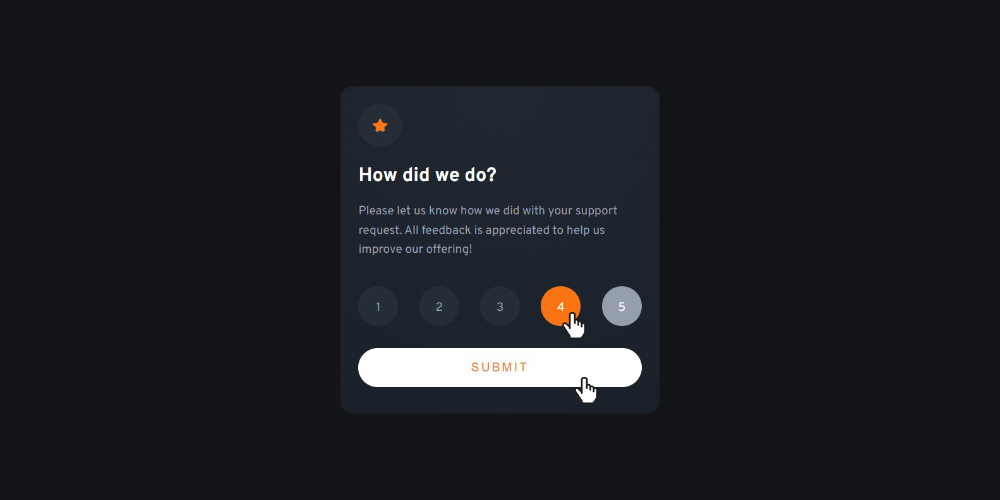

# Frontend Mentor - Interactive rating component

This is a solution to the [Interactive rating component challenge on Frontend Mentor](https://www.frontendmentor.io/challenges/interactive-rating-component-koxpeBUmI). Frontend Mentor challenges help you improve your coding skills by building realistic projects. 

## Table of contents

- [Overview](#overview)
  - [The challenge](#the-challenge)
  - [Screenshot](#screenshot)
  - [Links](#links)
- [My process](#my-process)
  - [Built with](#built-with)
  - [What I learned](#what-i-learned)
  - [Useful resources](#useful-resources)
- [Author](#author)
- [Acknowledgments](#acknowledgments)
  - [Useful project](#useful-project)

## Overview

### The challenge

Users should be able to:

- View the optimal layout for the app depending on their device's screen size
- See hover states for all interactive elements on the page
- Select and submit a number rating
- See the "Thank you" card state after submitting a rating

### Screenshot

### Links

- Solution URL: [Frontend Mentor](https://www.frontendmentor.io/solutions/interactive-rating-component--iNf_8mnpY)
- Live Site URL: [GitHub Page](https://akiraz14.github.io/interactive-rating-component/)

## My process

### Built with

- Semantic HTML5 markup
- CSS custom properties
- Flexbox
- Responsive Desing / Mobile-first workflow

### What I learned

It was an opportunity to practice HTML, CSS, and JS.

### Useful resources

- [W3Schools](https://www.w3schools.com/) - I love this website!!! I highly recommend it.
- [Box Shadow Generator](https://box-shadow.dev/)
- [CSS Generator](https://cssgenerator.org/)

## Author

- Website - [Akiraz14](https://akiraz14.github.io/)
- Frontend Mentor - [@Akiraz14](https://www.frontendmentor.io/profile/Akiraz14)

## Acknowledgments

I looked for another project that helped me to support my solution proposal.

### Useful project

- Frontend Mentor - [@catherineisonline](https://www.frontendmentor.io/profile/catherineisonline) - [Interactive rating component solution](https://github.com/catherineisonline/interactive-rating-component-frontendmentor)

**Note: I didn't replicate this solution, I just wanted to see someone else's proposal and I liked this one.**
